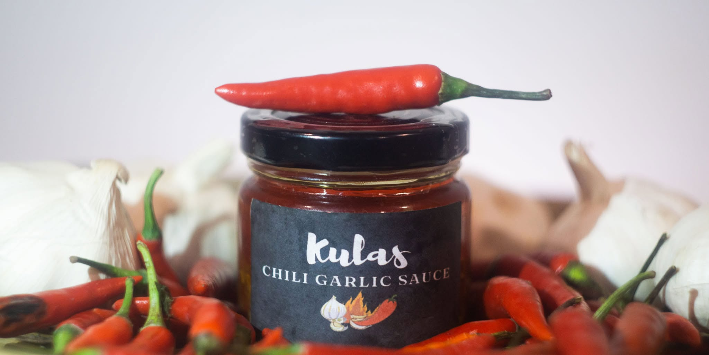

# 🌶️ Kulas Foods and Condiments

> **Ignite your taste buds with pure heat and flavor.**

An immersive, animated 3D landing page for **Kulas Chili Garlic Sauce** — a
procedurally built glass jar (real label photo wrapped onto the glass) floating
among orbiting chilies, garlic cloves, and drifting spice dust — backed by a
lightweight Express API that captures contact messages and newsletter signups.



---

## Tech Stack

| Layer      | Technology                                                           |
| ---------- | -------------------------------------------------------------------- |
| Frontend   | **Vite + React 19**                                                  |
| 3D         | **three.js**, **@react-three/fiber**, **@react-three/drei**          |
| Animation  | **Framer Motion** (staggered entrances, scroll reveals, hover FX)    |
| Styling    | **Tailwind CSS** (rustic/fiery palette, glassmorphism, grain)        |
| Backend    | **Node.js + Express** (CORS, validation, JSON-file persistence)      |
| Database   | `server/db.json` (created automatically on first write)              |

## Project Structure

```
.
├── package.json              # root — runs client + server concurrently
├── client/                   # Vite + React frontend
│   ├── index.html
│   ├── vite.config.js        # dev proxy: /api → http://localhost:3001
│   ├── tailwind.config.js    # brand palette & typography
│   ├── public/
│   │   ├── kulas-jar.jpg     # original product photo
│   │   └── textures/label.jpg# label crop used as the 3D jar texture
│   └── src/
│       ├── App.jsx           # page shell: fixed 3D backdrop + sections
│       ├── three/
│       │   ├── Scene.jsx     # canvas, lighting, env map, controls
│       │   ├── ChiliJar.jsx  # procedural jar (glass, sauce, lid, label)
│       │   ├── FloatingIngredients.jsx  # orbiting chilies & garlic
│       │   └── SpiceParticles.jsx       # red/gold dust particle field
│       ├── components/       # Navbar, Hero, About, Features, Contact, Footer
│       └── lib/              # api client + shared motion variants
└── server/
    ├── server.js             # Express API + static hosting of client/dist
    └── db.json               # runtime data (gitignored)
```

## Getting Started

Requires **Node.js ≥ 18**.

```bash
# 1. install everything (root + client + server)
npm run setup

# 2. run frontend and backend together (dev)
npm run dev
#    → client: http://localhost:5173   (Vite, hot reload)
#    → server: http://localhost:3001   (Express, auto-restart)
```

The Vite dev server proxies `/api/*` to the Express backend, so no extra
configuration is needed during development.

### Production

```bash
npm run build     # builds client → client/dist
npm start         # Express serves the built app + API on :3001
```

Open <http://localhost:3001>.

## API

| Method | Endpoint          | Body                        | Purpose                              |
| ------ | ----------------- | --------------------------- | ------------------------------------ |
| POST   | `/api/contact`    | `{ name, email, message }`  | Save a contact / wholesale inquiry   |
| POST   | `/api/newsletter` | `{ email }`                 | Save a newsletter signup + timestamp |
| GET    | `/api/health`     | —                           | Liveness check                       |

All inputs are validated server-side; entries are persisted to
`server/db.json` with UUIDs and ISO timestamps. Newsletter signups are
de-duplicated by email.

**Example:**

```bash
curl -X POST http://localhost:3001/api/contact \
  -H 'Content-Type: application/json' \
  -d '{"name":"Juan","email":"juan@example.com","message":"Wholesale pricing please!"}'
```

### Environment variables

| Variable      | Default                                        | Description                        |
| ------------- | ---------------------------------------------- | ---------------------------------- |
| `PORT`        | `3001`                                         | Express port                       |
| `CORS_ORIGIN` | `http://localhost:5173,http://127.0.0.1:5173`  | Comma-separated allowed origins    |
| `VITE_API_URL`| *(empty — same origin / dev proxy)*            | Point the client at a remote API   |

## The 3D Scene

- **Jar** — glass `CylinderGeometry` with `MeshPhysicalMaterial`
  (transmission), a dark-red sauce cylinder inside, a glossy black lid, and
  the product-label photograph wrapped onto an open cylinder segment hugging
  the front face.
- **Ingredients** — chilies are curved capsules (tube along a bent curve with
  capped ends + stem); garlic cloves are teardrop `LatheGeometry` profiles.
  Two counter-rotating rings drift them gracefully around the jar.
- **Atmosphere** — 450 red & gold dust particles rise and sway on a soft
  sprite; a procedural `Lightformer` environment gives the glass warm
  reflections with no HDR download.
- **Interactivity** — hover the jar to make it tilt & bob; the jar spins
  slowly as you scroll; drag to rotate (OrbitControls locked to the Y axis).

## License

MIT — see [LICENSE](LICENSE).
